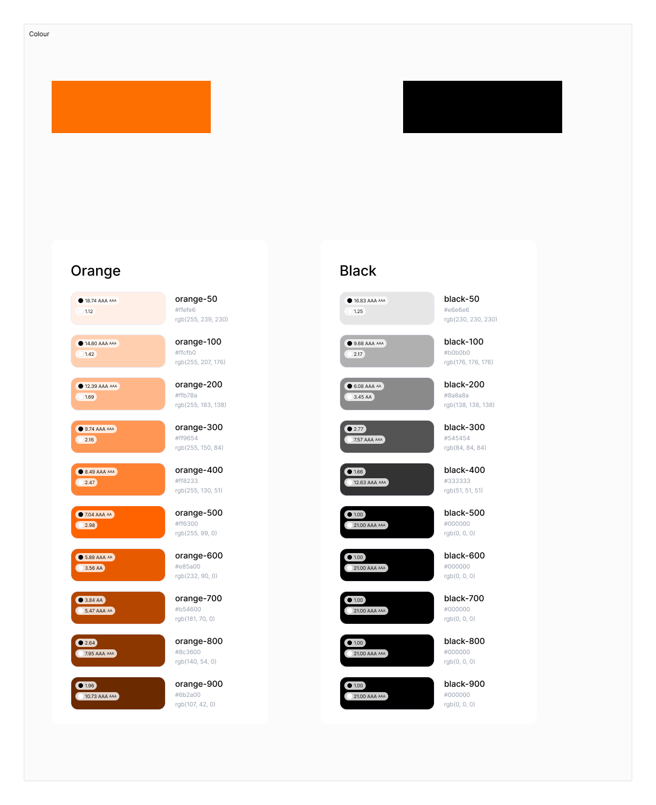
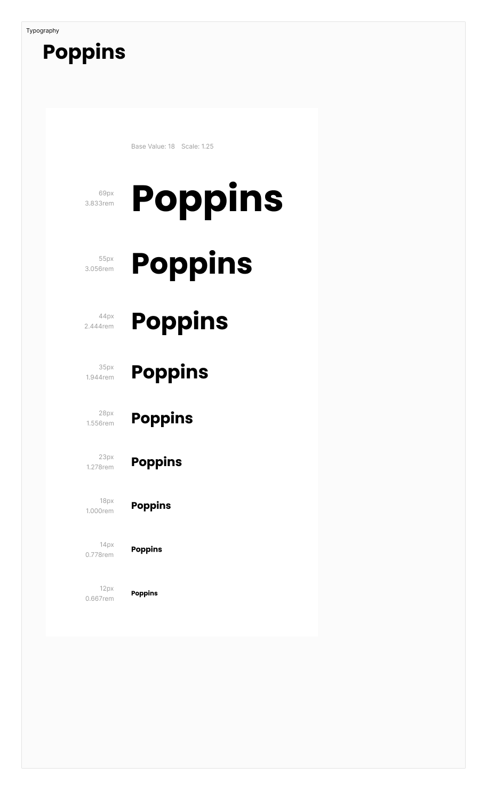
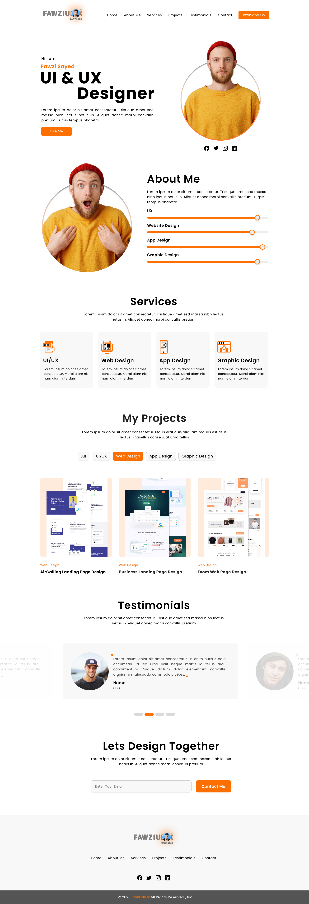
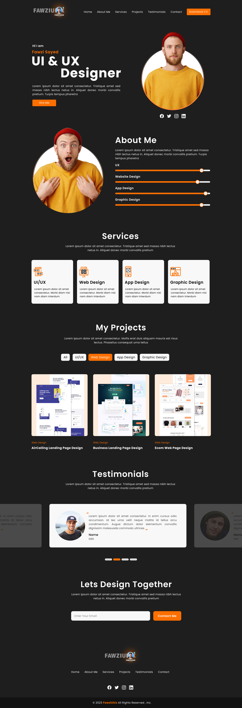

# Portfolio 01

This is the first personal portfolio template clone using HTML and CSS, based on a Figma design. The project is structured to follow the BEM (Block Element Modifier) methodology for better maintainability and readability.

## Given Figma Design

* ### Color Palette

  > 

* ### Typography

  > 

* ### Light Theme

  > 

* ### Dark Theme

  > 
